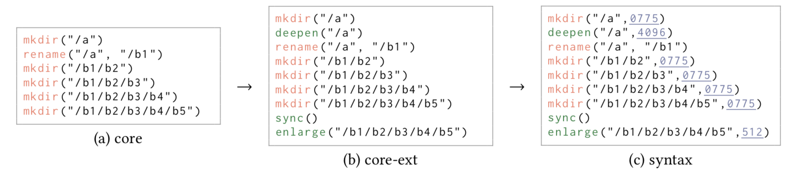
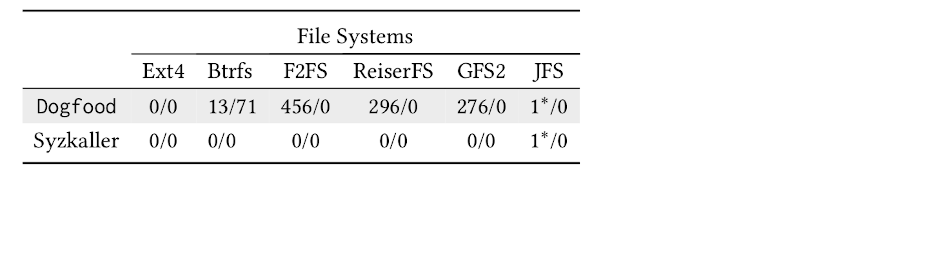
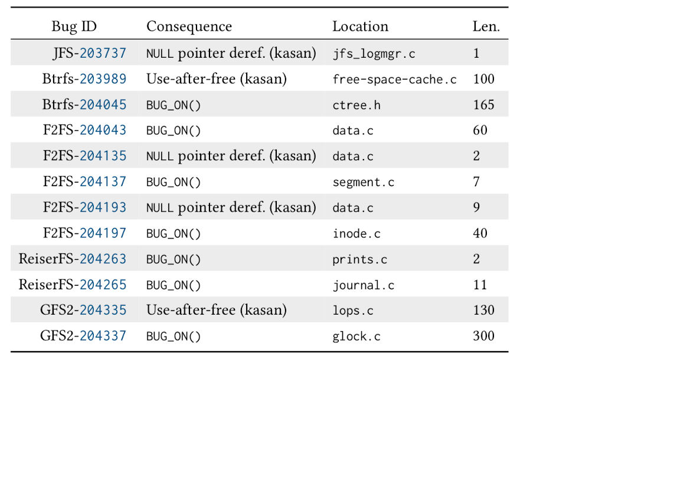

# 谈谈对于文件系统的测试

## 什么是文件系统

不管你是否已经了解文件系统，或者只是听说过这个名词，只要我们日常使用电脑、手机、或是其他设备，
我们都直接、间接地使用到了文件系统。

那么到底“什么是文件系统呢？”，我们从[维基百科](https://zh.wikipedia.org/wiki/%E6%96%87%E4%BB%B6%E7%B3%BB%E7%BB%9F)上得到的解释是：

> 文件系统是一种存储和组织计算机数据的方法，它使得对其访问和查找变得容易。

当然，这里的解释很学术，“存储”？“组织”？？“计算机数据”？？？😵（一脸问号）
我们在这里进行简单理解，即字面意思：文件系统就是用来管理文件的一个程序。
这里的文件就是我们在电脑里随处可见的各类文档、图片、电影等等等等所有保存在硬盘里的东西。
而我们日常对于文件的*操作*都将最后交由文件系统来处理；
例如，我们在 word 文档中*写入*内容、*读取*一张图片来显示、*删除*垃圾文件、对文件进行*重命名*等，
文件系统会负责把文件妥善保存好。

## 问题：为什么要测试文件系统

在简单了解完文件系统后，我们知道文件系统就是一个程序，并且实际上，它是一个非常复杂的程序，所以不可避免地就有程序员谈之色变的 BUG！
而因为文件系统至关重要，一旦有 BUG，就将导致很严重的问题，例如，保存的文件直接丢失了[😨](https://bugs.launchpad.net/ubuntu/+source/linux/+bug/317781?comments=all)。
既然这么重要的程序有潜在 BUG，那么测试作为软件质量保障的一大手段，我们就想更好/更多/更全面滴对文件系统进行测试。

## 目标：我们要完成什么

我们明确了大目标是测试文件系统，但这就是一个口号，怎么能具体进行测试呢？
最原（tu）始（hao）的测试方法就是雇佣程序员，让他/她没日没夜不断滴*使用*这个程序，然后在每次使用过程中*检查*是否出现问题。

> 一点专业术语：
> 在这个残暴的测试方案下，我们可以看到程序测试的两个重要部分：使用程序和检查出错；
> 使用程序就是要有程序输入，检查出错就是要有程序结果的判断标准。
> 在测试领域内，我们分别把这两个要素称之为 input（workload） 和 oracle。

但这对于程序员太幸苦了，我们想让他们早些摆脱 996，尽快回家，老婆孩子热炕头，所以就有了自动化测试。
而自动化测试就需要如同程序员一样完成两件事，一是使用程序，二是检查是否出问题。
这两个都是测试领域里非常重要的问题，但我们在这里更关注于*使用程序*这个问题上，对于如何检查是否出现问题，
我们采用已有工作，或是简单观察程序是否崩溃（毕竟程序崩溃是非常不友好且常见的体验，亟需解决）。
基于此，我们的小目标就是：更充分地自动化使用文件系统。

### 如何使用文件系统

从我们的使用经验出发，我们很容易抽象出是如何使用文件系统的：发号各种操作施令！
而在文件系统看来，这些操作有一个专有名词：*文件系统调用*。
当然，我们对于文件系统的使用一般都包含多个调用，例如：打开一张图片，（美颜管上），保存图片，（转念不满意），删除图片；
这些操作组成了*文件系统调用序列*。

因为使用文件系统就是有文件系统调用序列，我们换言之，
我们的小目标是：更好地自动化产生文件系统调用序列。

## 略带专业知识的介绍

下面我们将简单从计算机从业者的角度去介绍下问题和我们的解决思路，
如果不敢兴趣可以直接看下文末的广告🤓

### 问题定义

在我们平时的编程中，或多或少都会文件处理，open、read、write 等这些都不陌生。
不管是使用哪种编程语言，或是调用了哪个库函数，这些函数都将调用操作系统提供的文件系统调用（有点绕口）。
例如，打开一个文件，在 Linux 上会调用:

```C
int open(const char *pathname, int flags, mode_t mode);
```

这个系统调用。
那么，我们所要生成的文件系统调用序列其实就是一个程序（C 代码演示），

```C
int main() {
    int fd = open(path, flags, mode);
    read(fd, buf, count);
    unlink(path);
    // ...
    return 0;
}
```

这个程序里包含了一系列的文件系统调用。没错，问题就是这么简单！😝

### 文件系统调用生成的难点

首先，文件系统调用序列的生成不同与其一般的测试输入问题在于，我们无法用简单的*字节流*来抽象输入，
从而当下非常火的技术一些 fuzzing 技术/工具，像 AFL 我们就没法使用。
因为系统调用是是代码，所以我们的生成目标是结构化的*程序*（在这里就是一个含有系统调用的 C 程序），
没错，用生成程序自动化生成另一个程序；
如果将它抽象成字节流很容易就生成不合法的输入。

当然很显然，虽然我们的目标是生成一个 C 程序，但其实这个程序很简单，甚至不包含控制流，只是多个文件系统调用。
那么我们能否枚举所有可能的程序呢？答案是否定的。首先，这个程序包含的序列长度不定，它可以包含成千上万个系统调用；
其次，操作系统总共提供了数十个不同的文件系统调用有[戳我](http://linasm.sourceforge.net/docs/syscalls/filesystem.php)；
而每个调用又有不同的参数，所以调用序列的生成空间是巨大的。

既然我们要生成程序的文法（syntax）很简单，那么我们能否根据文法随机生成，更进一步可以采用模糊测试（像非常成熟的内核测试工具 [Syzkaller](https://github.com/google/syzkaller)）。
但这种仅仅根据文法进行随机生成的问题在于，文件系统调用是依赖语义信息的，例如：

```C
read(fd, buf, count);
```

我们更倾向于生成的这个调用中，`fd` 指向一个被正确打开的文件，如果 `fd` 是非法文件描述符，
那么这个系统调用将很快返回一个错误（error)，而没有执行其他代码，我们称之为 early return。

从另一方面，既然语义信息很重要，那么我们可以对文件系统建模，然后利用一大类“基于模型的测试”技术来产生输入 [1]。
这里的问题在于，文件系统太复杂了，我们基本上不可能充分地对它建模，甚至其实我们对于它的规约（specification）都不够明确 [2]。

```C
int fd = open(path, O_RDWR, O_CREAT);
remove(path);
write(fd, buf, count);
```

例如上述调用序列删除了打开的文件，然后再写入，发生了什么呢？？
此外，每个文件系统调用可接收的神奇参数（`O_ASYNC` 等诸多参数）、文件系统支持的不同特性等都会影响调用执行的语义，
把这些都建模是不可行的。

### 我们的技术方法

我们看到了语义信息对于生成系统发调用至关重要，然而对当前的文件系统进行建模又是几乎不可行的，
那么为什么建模难度这么大呢？答案还是文件系统的复杂性。
如果我们把目光回退到文件系统诞生之初，第一个文件系统相对是很简单的，它只有最基础且完善的功能——管理文件；
而随着发展，越来越多其他的功能、特性、优化被逐渐加入到其中，导致了复杂度的增加。

沿着相似的脉络，我们就想知道，“文件系统调用序列生成”能否有相似的步骤？
即，我们对最初的文件系统 `init-FS` 进行建模，然后在这个*简单模型*上生成文件调用序列，
再将这个调用序列一步步扩展，成为用来实际测试文件系统 `real-FS` 的输入。

这一方法有两个问题需要回答，
首先，我们在 `init-FS` 上生成的序列得同样在 `real-FS` 上合法，这一点能得到肯定的回答。
因为 `init-FS` 的是所有文件系统的基础，所以它允许的调用序列一定在其他文件系统上也被允许（不严谨地表述，
我们可以认为 `init-FS` 的语义是 `real-FS` 的子集）；
第二，我们在扩展过程中，需要尽可能地不破坏所生成系统调用的语义；
例如我们在 `init-FS` 上生成了 `open; read` 这一序列，如果在扩展中将 `open` 破坏了，
那么在 `init-FS` 中维护好的数据流依赖信息就丢失了。

我们利用了这一“在简单模型上生成，再一步步扩展”的想法，提出了”层次化建模来测试文件系统”。
如下图所示：



我们对最基础的文件系统进行建模，我们称之为 core 模型，在这个模型中，只有对文件组织结构的操作（创建、删除、重命名等）和文件描述符的打开/关闭。
在这个模型上生成的序列叫做*抽象序列*，因为这些抽象的系统调用不包含其他参数，不能被实际的文件系统执行。
并且，我们在这个简单模型上甚至可以用枚举的方式尽可能生成序列来导致不同的文件组织结构。

然后我们把抽象序列进行扩展，用于扩展模型是 core-ext，我们在这一模型中设计了不同的操作，作为补充的抽象调用加入。
他们分别针对批量大规模读写文件、改变文件的目录深度、文件同步等，用于触发文件系统的各种特性和优化。

最后我们把抽象序列扩展到实际符合语法的序列上，对于那些缺失参数的调用，我们随机地产生参数填补。

从另一个角度来看，我们的方法在对文件系统的语义建模和完全随机之中寻求一个平衡。
我们对文件系统中重要、简单、明确的部分进行建模，然后在此基础上生成调用序列，最后再把这些生成的序列进行随机扩展。

同时，层次化的建模方式在测试方法上，把文件系统调用序列生成这个问题进行了模块化的划分，
我们可以在不同层上设计抽象系统调用（针对不同的文件系统特性），用不同的生成策略（枚举，随机等）。

如果对更多细节感兴趣，看看我们的文章吧 [3]。🤓

### 实验结果

我们对以下六个不同的文件系统进行了测试：

- Ext4, Btrfs, F2FS, ReiserFS, GFS2, JFS

作为对比的是之前提及的工具 Syzkaller，我们把两个工具分别进行了 12 小时的测试，然后统计了能够发生的内核崩溃次数。

<!--  -->
<table>
  <tr>
    <th></th>
    <th colspan="6">File Systems</th>
  </tr>
  <tr>
    <td></td>
    <td>Ext4<br></td>
    <td>Btrfs<br></td>
    <td>F2FS<br></td>
    <td>ReiserFS</td>
    <td>GFS2<br></td>
    <td>JFS</td>
  </tr>
  <tr>
    <td>Dogfood</td>
    <td>0/0<br></td>
    <td>13/71<br></td>
    <td>456/0<br></td>
    <td>296/0</td>
    <td>276/0</td>
    <td>1*/0</td>
  </tr>
  <tr>
    <td>Syzkaller</td>
    <td>0/0<br></td>
    <td>0/0<br></td>
    <td>0/0<br></td>
    <td>0/0</td>
    <td>0/0<br></td>
    <td>1*/0</td>
  </tr>
</table>

老牌稳重的 Ext4 表现优秀，扛住了两个工具，而 JFS 上重复的崩溃过多也不做多考量；
在其他四个文件系统上，我们的表现都要优于完全的随机测试，一夜之间上百崩溃 😏。

之后，我们从这些崩溃中定位出了不同的 12 个作为 BUG 向开发者进行了上报，有部分得到了开发者的修复。

<!--  -->

| Bug ID          | Consequence                 | Location           | Len.|
|-----------------|-----------------------------|--------------------|-----|
| JFS-203737      | NULL pointer deref. (kasan) | jfs_logmgr.c       | 1   |
| Btrfs-203989    | Use-after-free (kasan)      | free-space-cache.c | 100 |
| Btrfs-204045    | BUG_ON()                    | ctree.h            | 165 |
| F2FS-204043     | BUG_ON()                    | data.c             | 60  |
| F2FS-204135     | NULL pointer deref. (kasan) | data.c             | 2   |
| F2FS-204137     | BUG_ON()                    | segment.c          | 7   |
| F2FS-204193     | NULL pointer deref. (kasan) | data.c             | 9   |
| F2FS-204197     | BUG_ON()                    | inode.c            | 40  |
| ReiserFS-204263 | BUG_ON()                    | prints.c           | 2   |
| ReiserFS-204265 | BUG_ON()                    | journal.c          | 11  |
| GFS2-204335     | Use-after-free (kasan)      | lops.c             | 130 |
| GFS2-204337     | BUG_ON()                    | glock.c            | 300 |

数据挺无聊的，我们看看一个简单的例子：

```C
mkdir("/a",0775)
mkdir("/a/b",0775)
mkdir("/a/b/c",0775)
rename("/a/b", "/e")
mkdir("/e/c/f",0775)
mkdir("/e/c/f/g",0775)
create("/e/c/f/g/h",0775)
open(fd, "/e/c/f/g/h",O_RDWR)
prune("/e/c/f/")
sync()
write(fd, 57344)
```

在上述的调用序列里，首先创建了不少目录和文件，接着是打开一个文件 `"/e/c/f/g/h"`，之后这个文件将被
`prune` 操作删除（这个操作是我们在 core-ext 中设计的抽象调用），最后再次写入这个已经打开的文件描述符时，
ReiserFS 发生了错误。当然，这里写入打开的文件描述符，但已被删除的文件，这一行为是有明确描述的哦（[戳我](http://man7.org/linux/man-pages/man2/unlink.2.html))，这里仅仅是触发了 ReiserFS 的 BUG。

### 致谢

这里要向（应该是华为的）一个 F2FS 的开发者大大表示感谢；实验过程中，我上报了 BUG 之后很快给了我回复，让我对这份工作有了坚持完成的动力。感谢！！！

## 总结（广告）

> 我们组里人都超 nice 的，老板人好不给压力， 师兄师弟日常面基，师妹。。。越来越少😢。 如果你对写代码有兴趣、对程序分析有感觉，欢迎加入🤓。

[我们是南京大学 System & Program Analysis (SPAR) Group](http://ics.nju.edu.cn/spar/)

## 引用文献

- [1] Arilo C DiasNeto, Rajesh Subramanyan, Marlon Vieira, and Guilherme H Travassos. A Survey on Model-based Testing Approaches: A Systematic Review.

- [2] Tom Ridge, David Sheets, Thomas Tuerk, Andrea Giugliano, Anil Madhavapeddy, and Peter Sewell. SibylFS: Formal Specification and Oracle-based Testing for POSIX and Real-world File Systems.

- [3] Dongjie Chen, Yanyan Jiang, Chang Xu, Xiaoming Ma, and Jian Lu. Testing File System Implementations on Layered Models.

*作者简介*：本文作者包括南京大学的博士生（即将求职的高年级马仔，恳请有意向的大佬捞我）陈冬杰、蒋炎岩博士、许畅教授、马晓星教授和吕建教授。
